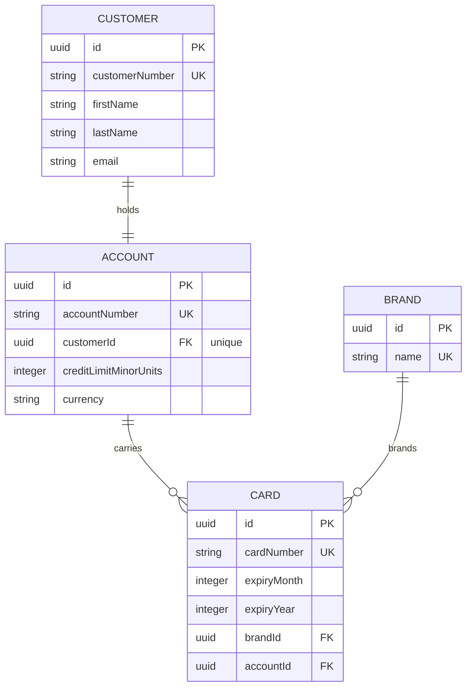

## Summary

First three feeds from the business brief:

- Card brands from the CRM (`brands.csv`).
- Customers with their credit card account from the CRM export (`customers.csv`, one row per account).
- Issued cards from card operations (`cards.csv`).

Changes:

- `Brand`, `Customer`, `Account` and `Card` entities under `src/domain/`. `Account` is one-to-one with
  `Customer`: every customer has a credit card account.
- `BrandsCsvProcessor`, `CustomersCsvProcessor` and `CardsCsvProcessor` under `src/ingestion/processors/`,
  each with a unit spec. Cards resolve their brand by name and their account through the customer number.
- `AccountCardsQuery` as the read contract the acceptance check drives.
- Fixtures refreshed from the CRM and card-ops exports taken on 2026-09-19.

## Data model

Money is stored as integer minor units with the currency in its own column. Card numbers are held in
full for the exercise; a real system would tokenise them.

## How to test

    npm test
    npm run ingest -- --source crm --type brands fixtures/brands.csv
    npm run ingest -- --source crm --type customers fixtures/customers.csv
    npm run ingest -- --source card-ops --type cards fixtures/cards.csv

## Assumptions

- Each customer has exactly one credit card account (brief, rule 3).
- Brand names in the card-ops feed match the CRM brand list exactly.

## Risk Assessment

low. New tables only, nothing downstream reads them yet. A mis-parsed credit limit would store the wrong
minor-unit amount without failing.
