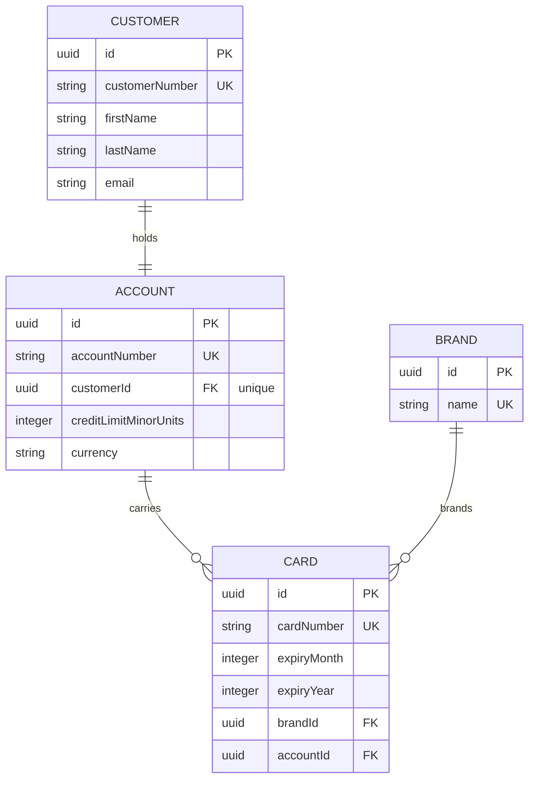

# Credit card company: data ingestion

A small ingestion service for a credit card company. Files arrive from upstream systems, a processor
that recognises the file turns it into rows, and those rows are written to a SQLite database.

The business rules are in [BRIEF.md](BRIEF.md). If a rule is ambiguous, ask.

## Running

    nvm use            # or any Node >= 20
    npm install
    npm test           # unit and integration tests, in-memory database
    npm run ingest -- --source crm --type brands fixtures/brands.csv
    npm run ingest -- --source crm --type customers fixtures/customers.csv
    npm run ingest -- --source card-ops --type cards fixtures/cards.csv

The CLI writes to `data/exercise.sqlite`. Delete the file to start again. The schema is built from the
entity classes on start-up (`synchronize: true`); adding an entity and registering it in
`src/database/data-source.ts` is all a schema change needs.

## How ingestion works

1. `IngestionService.ingest(buffer, fileMeta)` asks every registered `FileProcessor` whether it
   `matches(fileMeta)`. Exactly one must.
2. The processor's `process(buffer, fileMeta)` returns plain arrays of entities under named keys, plus
   an optional `errors` list. Any error rejects the whole file and nothing is written.
3. `ProcessedDataWriter` saves each key in the order given by `PERSISTENCE_ORDER`, inside one
   transaction. A failure names the key and the row.

Processors live under `src/ingestion/processors/<source>/`. Each has a unit spec beside it. The
integration spec in `test/ingestion.spec.ts` runs the real fixtures through the real wiring.

## Data model

Money is stored as integer minor units with the currency in its own column. Card numbers are held
in full for the exercise; a real system would tokenise them.

## Session rules

- Use Claude Code or any LLM you like. We do the same. We care that you understand what lands in the repo.
- Ask questions. The brief is the brief a real business wrote, which means it is incomplete.
- The fixtures under `fixtures/` and the existing test expectations are the business's acceptance
  data. You may change them, but say why out loud when you do.
- The PR has two CI checks. `unit` runs what you can see. `acceptance` runs a file you have not seen,
  the way QA would. Both need to be green.
- New columns on existing feed files must be optional. Existing feeds do not change because you added a
  new one.

## Stable contract

The acceptance check drives the system only through `IngestionService.ingest` and the class
`AccountCardsQuery` in `src/domain/queries/account-cards.query.ts`:

    cardsOnAccount(accountNumber: string): Promise<{ cardNumber: string; brandName: string }[]>
    brandNames(): Promise<string[]>

Keep those two signatures stable. Change everything behind them freely.

## If `better-sqlite3` will not install

Prebuilt binaries exist for macOS (arm64, x64), Windows and Linux on Node 20 and 22. If yours fails,
swap the driver: `npm install sqlite3`, and in `src/database/data-source.ts` change `type` to
`'sqlite'`. Nothing else changes.
